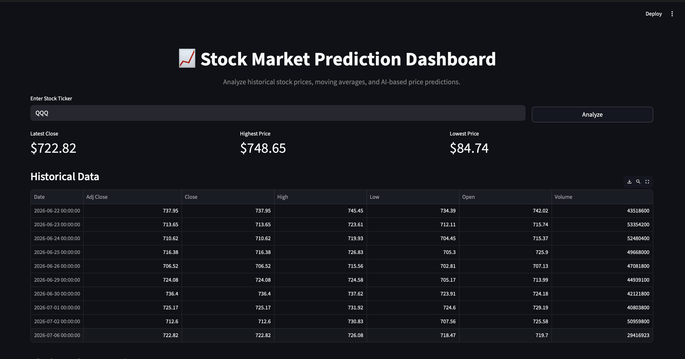
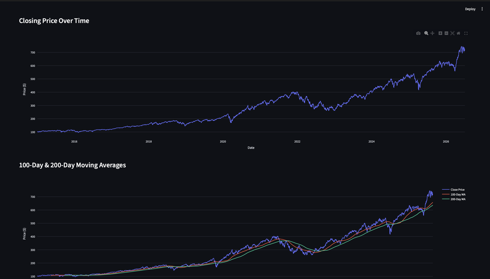
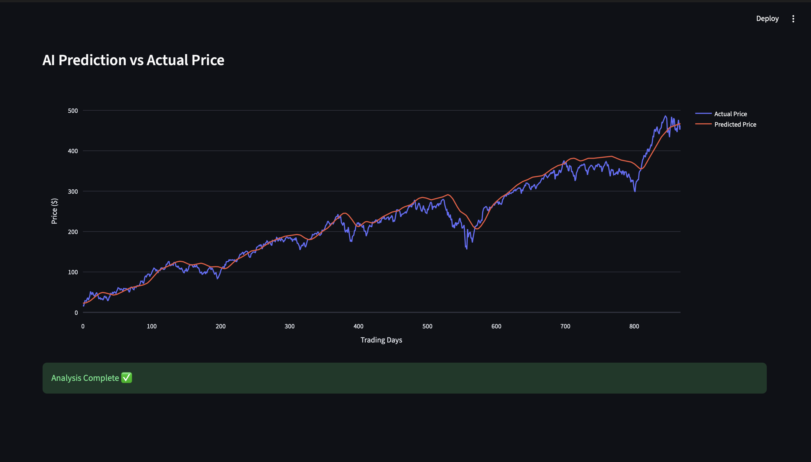

# 📈 AI Stock Market Prediction Dashboard

An AI-powered stock market analysis dashboard built with **Python**, **Streamlit**, **TensorFlow**, and **Yahoo Finance**. The application allows users to visualize historical stock performance, analyze market trends using moving averages, and compare AI-generated predictions with actual stock prices through an intuitive interactive dashboard.


---

## 🚀 Live Demo

🔗 **Live Application:** https://your-streamlit-app.streamlit.app

---

## 📸 Application Preview

### 🏠 Dashboard



---

### 📊 Closing Price & Moving Average Analysis



---

### 🤖 AI Prediction vs Actual Stock Price



---

## ✨ Features

- 📈 Interactive historical stock price visualization
- 🤖 AI-powered stock price prediction using an LSTM model
- 📊 100-Day and 200-Day Moving Average analysis
- 📉 Actual vs Predicted price comparison
- 🔍 Search stocks using ticker symbols (AAPL, NVDA, TSLA, META, MSFT, etc.)
- ⚡ Interactive Plotly charts
- 📋 Historical market data table
- 🌙 Modern responsive dashboard built with Streamlit

---

## 🛠️ Tech Stack

### Frontend
- Streamlit
- Plotly

### Machine Learning
- TensorFlow
- Keras
- LSTM (Long Short-Term Memory)

### Data Processing
- Pandas
- NumPy
- Scikit-learn

### Data Source
- Yahoo Finance (yfinance)

---

## 📂 Project Structure

```text
StockPrediction/
│
├── screenshots/
│   ├── dashboard.png
│   ├── closing-price-ma.png
│   └── ai-prediction.png
│
├── main.py
├── keras_model.keras
├── StockMarket.ipynb
├── requirements.txt
└── README.md
```

---

## ⚙️ Installation

### Clone the repository

```bash
git clone https://github.com/Nishant1016/StockPrediction.git
```

### Navigate to the project

```bash
cd StockPrediction
```

### Create a virtual environment

```bash
python3 -m venv venv
```

### Activate the environment

**macOS / Linux**

```bash
source venv/bin/activate
```

**Windows**

```bash
venv\Scripts\activate
```

### Install dependencies

```bash
pip install -r requirements.txt
```

### Run the application

```bash
streamlit run main.py
```

---

## 📊 How It Works

1. Enter a stock ticker symbol (e.g., AAPL, TSLA, NVDA).
2. Historical stock market data is fetched using Yahoo Finance.
3. The closing prices are preprocessed using MinMaxScaler.
4. A pre-trained LSTM model predicts future stock prices.
5. Interactive charts compare predicted prices with actual market performance.

---

## 🎯 Future Improvements

- 📊 Candlestick charts
- 📈 Technical indicators (RSI, MACD, Bollinger Bands)
- 📰 Financial news integration
- 🤖 AI-generated stock insights
- ⭐ Watchlist functionality
- 📱 Mobile-friendly dashboard
- 🌍 Multi-stock comparison

---


